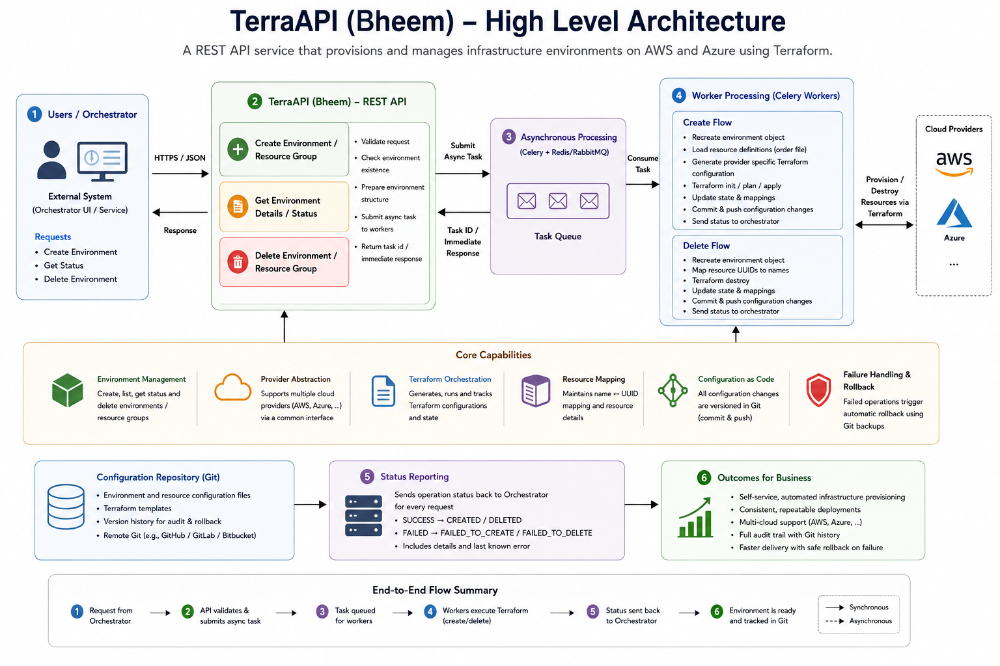

# Statement

Write a summary of a project/initiative and system that you built or significantly
improved as a leader or owner. Include the following:

* Background and the original issues to be solved
* Architecture diagram
* Team structure
* Quantitative goals (OKRs, KPIs, etc.) and outcomes
* The biggest decision you made and got approved during the project/initiative

# Project
The project that I want to present is Bheem(Big & Humongous Environment Emulation Module)

# Background
Uber had launched in India in 2013.
Olacabs had raised $900 million in funding in 2015.

Olacabs is under huge pressure to scale fast both because of investors and
because of its battle with Uber to secure larger market share.

At that point Olacabs applications were deployed on Mesos/Marathon(similar to
Kubernetes) stack.

The with rapid expansion came the need to test and deploy things fast.

Year is 2016. Terraform was not so popular yet but slowly gaining attention.

Mid of 2017, Azure onboard Olacabs as its customer. Olamoney needed to get PCI
DSS (Payment Card Industry Data Security Standard) certification in 2017. It
was decided to move Olamoney to Azure because Azure was providing huge
credits/free tier as Olacabs was new customer.

* This led to the need for creating anonymous/temporary environments fast and in a
standardized way.
* Have a grip over cloud bills
* Move fast on multi cloud 

# Issues to be solved

1. Manual Infrastructure Provisioning Was Error-Prone and Inconsistent

Infrastructure was being provisioned manually, which led to configuration
inconsistencies and security risks across environments. For example, IAM roles
could be granted more privileges than necessary, security groups could expose
more ports than required, and different environments could use different
instance types for the same workload. This made environments harder to govern,
increased security exposure, and made infrastructure behavior less predictable.

2. Infrastructure Provisioning Was Dependent on Specialized Engineers

Creating environments required engineers with knowledge of Terraform, cloud
infrastructure, and the organization's infrastructure conventions. Requiring
every engineering team to develop this expertise was impractical, particularly
when teams needed environments quickly.

3. The Infrastructure Abstraction Needed to Match the Actual Environment

The organization needed to provision Mesos/Marathon environments, not arbitrary
cloud infrastructure. Building or exposing an abstraction for every AWS/Azure
resource would have created unnecessary complexity and an enormous maintenance
burden. The challenge was to identify and standardize only the resources
required to create the organization's environments.

4. Infrastructure Changes Needed Consistent Auditability and Recovery

Manual changes and automated provisioning could leave configuration in an
inconsistent state when an operation failed partway through. There was a need
for a consistent mechanism to track infrastructure configuration changes and
recover from failed provisioning operations.

5. Infrastructure Ownership and Cost Attribution Needed to Be Enforced

As infrastructure became self-service, the organization needed to reliably
associate provisioned resources with the user/team requesting them and apply
the appropriate ownership/cost tags. This could not depend on individual users
remembering to configure those attributes correctly.

	User
	  │
	  │ authenticated request
	  ▼
	UI / Orchestrator
	  │
	  │ identity + environment request
	  ▼
	Bheem
	  │
	  ├── standardized configuration
	  ├── provider abstraction
	  ├── Terraform
	  └── Git / rollback
	  │
	  ▼
	AWS / Azure
	  │
	  └── tagged resources
		  │
		  ▼
	      Team / Cost
	      attribution

# Architecture

## Architecture Explaination

At the top, an engineer interacts with an internal UI to request a
Mesos/Marathon environment. Because the request comes through an authenticated
UI, the platform knows who is requesting the environment and which team they
belong to. That identity can then be used for ownership and cost attribution.

The Orchestrator receives the user's request and acts as the system
coordinating the environment lifecycle. It sends a provisioning request to
Bheem/TerraAPI, rather than asking the user or application team to interact
directly with Terraform.

Bheem is the infrastructure provisioning layer. Its purpose is to hide the
complexity of cloud infrastructure and Terraform behind a simpler
environment-level API. The API accepts things such as the environment, cloud
provider, region, account, and resource group.

The request is then handed to Celery for asynchronous execution. This is
important because provisioning infrastructure can take considerably longer than
a normal API request. The API can acknowledge the request and return a task ID
while the actual infrastructure creation happens in the background.

The Celery worker creates an Environment object. This is the central
abstraction in Bheem. The environment knows what environment is being created,
but doesn't need to contain provider-specific implementation details. It
obtains the appropriate provider and Terraform creator through
abstractions/factories.

The resource group represents the set of infrastructure components required for
that particular environment. Its configuration is read in a defined order, each
component is passed to the appropriate provider implementation, and the
resulting configuration is given to Terraform.

Terraform is therefore the execution engine, not the user-facing platform. It
takes the generated infrastructure configuration and actually creates or
deletes the resources in AWS/Azure.

Once provisioning finishes, Bheem uses Terraform state to determine the
resulting resources and their status. It then sends a normalized result back to
the upstream orchestrator, including resource-level status and errors when
provisioning fails.

Finally, the configuration changes are persisted through Git. Successful
operations are committed and pushed, while failed operations can trigger
rollback of affected configuration files.

# Team Structure

Project Owner / Sole Engineer — 1

I owned the project end-to-end, including the architecture, design,
implementation, Terraform integration, provider abstractions, asynchronous
execution, failure handling, Git-based configuration management, and
integration with the existing platform UI.

The platform UI was an existing system and is outside the scope of this
project. It consumed the Bheem/TerraAPI APIs to request environment
provisioning and receive provisioning status.

I worked with the broader platform stakeholders to understand provisioning
requirements, validate the solution, and get approval to make the platform the
standard path for environment creation. Subsequent engineers could contribute
by adding configurations or extending supported resource types, while I
remained the owner of the core provisioning platform.

# Quantitative Goals

1. Make infrastructure provisioning self-service

Enable engineering teams to provision Mesos/Marathon environments quickly
without requiring direct involvement from infrastructure specialists.

Key Results:

* Reduce environment provisioning time from 2+ days → 30 mins.
* Increase environments provisioned through self-service from 0% → 70%.
* Support 20+ through the platform.

2. Standardize and improve the quality of infrastructure

Eliminate the inconsistency and security risks inherent in manual
infrastructure provisioning by making environments reproducible and
standardized.

Key Results:

* Platform enforced a single standardized configuration.
* Increase successful first-time provisioning to 80+%.

3. Make infrastructure ownership and cost accountable

Ensure that self-service infrastructure remains governed, attributable, and
financially accountable.

Key Results:

* Increase resources with valid team ownership tags from 40% → 100%.
* Increase infrastructure costs attributable to teams from 60% → 80+%.

# Biggest feature that got approved

After the initial demonstration, we got agreement that the cloud console would
no longer be used for environment creation. Environment creation would be
performed through the platform, and engineers would contribute by improving
configurations or extending supported resources rather than manually
provisioning infrastructure.
